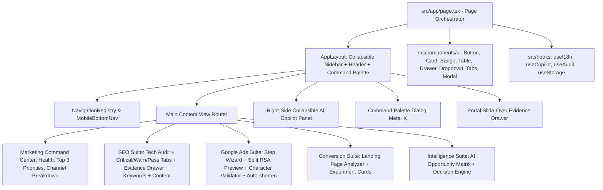

# oiSio — Comprehensive UX & Product Architecture Audit

---

## 1. Executive Summary

**oiSio** is positioned as an **Enterprise AI Marketing Intelligence Platform** providing cross-channel insights (SEO, Google Ads SEA, CRO, Content Intelligence, and AI Decision Matrix). While the underlying computational core (SSRF protection, deterministic scoring, Unicode-aware RSA validation, and prompt injection barriers) is robust, the user interface in v1.0 suffered from monolithic structure, visual noise, KPI overload, and lack of progressive disclosure.

This audit details the findings and lays the blueprint for transforming oiSio into a Linear/Stripe/Vercel-caliber professional B2B SaaS tool.

---

## 2. Current Architecture & Codebase Assessment

### 2.1 File Organization & Structure

- **Monolithic View**: `src/app/page.tsx` currently contains navigation state, live audit forms, RSA character counter, Copilot chat interface, and sub-views within one 500+ line client component.
- **Component Reusability**: Lack of an atomic `src/components/ui/` design library (Button, Badge, Drawer, Table, Dropdown, Modal, Card, Skeleton). Styles are duplicated via inline Tailwind classes.
- **State Segregation**: Local state, form state, and API network states are bundled in single component hooks without clear domain boundaries.

### 2.2 Information Architecture (IA) Deficiencies

- **Tab-based Flat Structure**: All modules (Audit, RSA, Copilot) are presented as simple top-level tabs rather than an organized multi-dimensional SaaS product hierarchy with dedicated sub-views.
- **Navigation Crowding**: Language and currency pickers were placed as raw button groups directly in the header banner rather than clean dropdowns.

---

## 3. Top 20 UX Problems Identified

1. **Simultaneous Metric Overload**: Users are greeted with 6 distinct numeric cards with identical visual weights, obscuring the primary takeaway.
2. **Missing "What / Why / Impact / Action" Framework**: Metric numbers are presented without clear root-cause context or automated next steps.
3. **Flat Tab Navigation**: Lacks multi-level hierarchy (SEO → Technical, Keywords, Content; Ads → Campaigns, Keywords, Ad Copy).
4. **Button Strip Language Picker**: Showing 6 individual language buttons (`EN`, `DE`, `TR`, `FR`, `IT`, `ES`) clutters header real estate.
5. **Button Strip Currency Picker**: Showing 5 currency buttons (`CHF`, `EUR`, `USD`, `GBP`, `TRY`) introduces noise.
6. **Lack of Progressive Disclosure**: Raw JSON evidence and technical error traces are shown in-line rather than inside a slide-over drawer.
7. **No Global Command Palette (`Cmd+K`)**: Power users cannot quickly jump between sections, trigger crawls, or search keywords.
8. **Monolithic Form for Ads**: Google Ads configuration is not presented as a guided step-by-step wizard.
9. **No Inline AI Shortening Action for RSA**: When a headline exceeds 30 characters, the user is warned but cannot click a single button to auto-shorten with AI.
10. **Copilot Hidden as a Full Tab**: AI Copilot should be an omnipresent, collapsible right-hand assistant accessible from any view.
11. **Keyword Table Lacks Table Controls**: Missing sticky headers, multi-column sorting, search filters, and status tags.
12. **Absence of Content Opportunity Board**: Content recommendations are not organized by Funnel Stage (TOFU/MOFU/BOFU) or Priority status.
13. **Generic Error Messages**: API errors need actionable human explanations with retry mechanisms.
14. **No Global Project / Domain Switcher**: Users managing multiple clients or domains have no dedicated dropdown switcher.
15. **Lack of Breadcrumbs**: Deep navigation lacks hierarchical breadcrumbs.
16. **No Context-Aware Date Range Filter**: Analytics lack global persistent date selectors (7d, 28d, 90d, 12m).
17. **Absence of Mobile Bottom Navigation**: Mobile screen squeezed desktop elements rather than providing dedicated bottom app bars.
18. **Unclear Source Attribution**: Differentiating between Crawl Data, Google Ads API data, and AI Estimates requires clearer badges.
19. **Missing Task Conversion Action**: Users cannot directly convert an AI recommendation into an actionable workflow task with one click.
20. **No Notification Center**: System lacks a dedicated drop-down center for crawl completion and anomaly alerts.

---

## 4. Top 20 Visual & UI Problems Identified

1. **Uniform Card Styling**: Every section is styled as an identical dark rounded card (`rounded-xl border border-slate-800 bg-[#0d1424]`), flattening visual depth.
2. **Excessive Gradient Highlights**: High-contrast glowing gradients distract from actual marketing data.
3. **Inconsistent Spacing Rhythm**: Inconsistent paddings (`p-3.5`, `p-5`, `p-6`, `p-8`) across components.
4. **Tabular Numerals Missing**: KPI numbers shift slightly when updating due to proportional font rendering.
5. **Badge Color Overuse**: Emerald, indigo, blue, amber, and rose badges placed in close proximity without strict hierarchy.
6. **No Defined Elevation System**: Lack of subtle z-index shadows and layered border definitions for overlays vs surfaces.
7. **Unrefined Sidebar State**: Active sidebar items used stark solid indigo fills rather than subtle modern active states.
8. **Cluttered Mobile Headers**: Responsive breakdown squashes headers into multiple wrapping rows.
9. **Low-Density Table Rows**: Tables consume excessive vertical space without compact mode options.
10. **Lack of Skeletons During Fetch**: Loading states rely on basic text pulses instead of structured UI skeletons.
11. **Text Contrast Ratios**: Some muted gray texts (`text-slate-500` on dark background) fall below WCAG 2.2 AA 4.5:1 ratio.
12. **Icon Library Misalignment**: Occasional raw inline SVG icons mixed with Lucide components.
13. **Absence of Focus Visible Rings**: Keyboard tab users do not see high-visibility focus indicator rings.
14. **Overly Prominent Brand Glow**: The brand mark uses an oversized glow shadow.
15. **Missing Empty State Illustrations**: Empty or unconfigured states lack structured illustrations and clear CTAs.
16. **No Dark / Light / System Mode Toggle**: Hardcoded dark theme without user-preference detection.
17. **Lack of Tooltips in Collapsed Sidebar**: Shrinking the sidebar hides label context without tooltip hover fallbacks.
18. **Unconstrained Modal Overlays**: Error alerts push layout down instead of floating or sliding smoothly.
19. **Sub-optimal Text Line Lengths**: Some recommendation descriptions span beyond 80 characters per line without max-width constraints.
20. **Lack of Micro-Interactions**: Button clicks and state transitions lack subtle spring or 150ms ease-out transitions.

---

## 5. Top 15 Technical Frontend Problems Identified

1. **Single-File Monolith (`src/app/page.tsx`)**: Exceeds single responsibility principles.
2. **Missing Component Abstraction**: Absence of reusable UI building blocks in `src/components/ui/`.
3. **Hardcoded Strings in Sub-components**: Some sub-labels bypassed the translation dictionary.
4. **No Centralized Navigation Registry**: Navigation routes and icons are hardcoded in local array literals.
5. **Lack of Client/Server Component Boundary**: Entire dashboard is forced into a `'use client'` root without partial pre-rendering.
6. **Unoptimized CSS Import**: Tailwind v4 configuration requires clean `@theme` variable mapping.
7. **No Toast Notification System**: Success and failure feedback relied on inline banner state.
8. **Missing Command Palette Engine**: No keyboard event listener (`keydown` for Meta+K / Ctrl+K).
9. **Unmemoized Heavy Calculations**: Deterministic scoring and string character counting re-evaluated on every render.
10. **Missing Form Abstraction**: Input handlers duplicate state setters for headlines and descriptions.
11. **Lack of Custom Hooks**: Missing `useI18n`, `useNavigation`, `useCopilot`, `useAudit` hooks.
12. **No Drawer / Slide-Over Primitive**: Lacks portal-based side-sheet for deep evidence inspection.
13. **Unchecked Window Resizing**: Sidebar collapse state does not automatically adapt to viewport breakpoints.
14. **Missing LocalStorage Persistence**: Language, currency, and collapsed sidebar states reset on browser refresh.
15. **Lack of Component-Level Unit Tests**: Tests cover core services (`src/core/*`) but lack UI component rendering tests.

---

## 6. Recommended Architecture & Solution Design

---

## 7. Prioritized Redesign Roadmap

- **Phase 1: Architecture & UX Documentation** (Complete)
- **Phase 2: Design Tokens & Atomic UI Primitives** (`components/ui/*`)
- **Phase 3: Navigation, Layout, Collapsible Sidebar & Command Palette (`Cmd+K`)**
- **Phase 4: Marketing Overview Command Center (Health Score + Action-First Top 3 Matrix)**
- **Phase 5: Technical SEO Suite (Audit, Critical/Warning/Passed Tabs, Evidence Drawer, Keywords)**
- **Phase 6: Google Ads Suite (Wizard, Split RSA Live Preview, Auto-Shortener, Policy Shield)**
- **Phase 7: Intelligence & Collapsible Marketing Copilot Assistant**
- **Phase 8: Responsive, Mobile Navigation & Multi-Language Dropdowns**
- **Phase 9: Comprehensive Testing (Vitest, Typecheck, Build Verification)**
